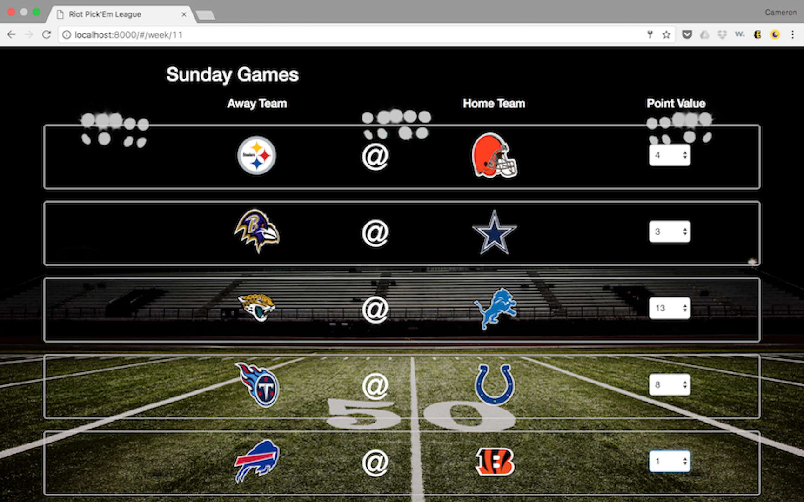

<h1>NFL Weekly Pick'em League</h1> 

How do I dropdown?

 
This is how you dropdown.

If interested in using this app, please read <a href="#disclaimer">this disclaimer</a> first

This web app is designed for users to to play "Pick'em" Fantasy Football.

## Whats Pick'em Fantasy Football???
 The object is for the user to predict the winner of each and every NFL game, on a weekly basis. Each user assigns a point value for each game based on their certainty of the game outcome (ie 13 points if the pick will DEFINITELY be right and 1 point if it's a rough guess). Each correct prediction yeilds the user the assigned point value.  Score is totaled for all picks for the week, and a running total is compiled for the season.  

 

### Some Feautures of this app
 * a login/registration with front and back end validation and error messaging 
 * a discussion board for users to interact and "discuss" weekly choices
 * multiple external API calls to mine live NFL game data which is displayed on the dashboard and compared to the users' picks in real time on game days. 

## For the Developers
This app was built with MongoDB, Node/Express server, and AngularJS.  If comfortable deploying this type of application feel free to:

 1. Clone this repo
 2. Add any custom logos to the login page
 3. Deploy to a favorite hosting site

 The app will automatically assign the first user that is registered as the super user, allowing full control of the database and integration.

 Enjoy! 

 ## Disclaimer
 This project is not currently working.  This ReadMe file was created as an exercise in creating better GitHub ReadMe's, and illustrates many aspects of this project that do not exist.  Please reach out if you have any further questions, but this is not a currently working project
